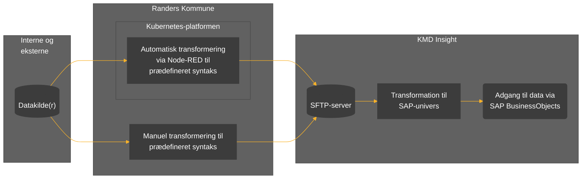

# Projektnavn  `README.md`
[**Formål**](#formål) | [**Beskrivelse**](#beskrivelse) | [**Afhængigheder**](#afh%C3%A6ngigheder) | [**Udvikling**](#udvikling)

## Formål

Kort beskrivelse af projektets formål.

*Eksempel:*
> Formålet med dette projekt er at lave en generisk ETL-service (_extract_, _transform_ og _load_) til up- og download af data til og fra Randers Kommunes KMD Insight løsning.

*Eksempel fra [custom-data-connector/README.md](https://github.com/Randers-Kommune-Digitalisering/custom-data-connector/blob/main/README.md).*

## Beskrivelse

Beskrivelse af den proces som løsningen varetager, herunder Mermaid diagram til illustration af dataflows. Procesbeskrivelsen opdeles i sektioner hvis løsningen varetager forskellige processer eller flere subprocesser.

*Eksempel:*

*Herunder beskrives processen mere detaljeret. Eksempel fra [custom-data-connector/README.md](https://github.com/Randers-Kommune-Digitalisering/custom-data-connector/blob/main/README.md).*

## Afhængigheder

Henvisninger til applikationens afhængigheder, kategoriseret og med links til officielle websites.

:gear: | Frameworks, komponenter og moduler som er del af løsningen

:cloud: | API'er, CDN'er og andre online services som applikationen kommunikerer med

## Udvikling

Beskrivelse af hvordan løsningen installeres og startes i et CodeSpace.
Beskrivelse af eventuelle API endpoints som løsningen udstiller.
Notering af eventuelle hard-codede værdier, og hvordan værdierne kan ændres.
