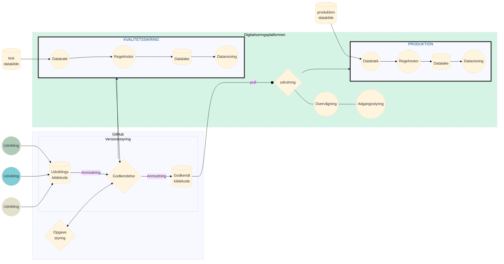

# Arkitektur overblik 

Løsningsarkitektur Q12023 til understøttelse af [Principper og Metoder](principper-metoder-værktøjer.md)

```mermaid
%%{init: {'theme':'base'}}%%

flowchart LR

subgraph Digitaliseringsplatformen
    
    DEP{udrulning}---
    GRAF((Overvågning))---
    ADG((Adgangsstyring))
    
    subgraph PRODUKTION
    DKTP((Datatræk))-->
    RMP((Regelmotor))-->
    DLP[(Datalake)]-->
    DVP((Datavisning))
    end
    
    subgraph KVALITETSSIKRING
    DKTT((Datatræk))-->
    RMT((Regelmotor))-->
    DLT[(Datalake)]-->
    DVT((Datavisning))
    end
    
end

subgraph GitHub

    subgraph Versionsstyring
    dev-branch[(Udviklings \n kildekode)]--Anmodning-->
    review{Godkendelse}
    main-branch[(Godkendt \n kildekode)]
    end
    
    OGS{Opgave\nstyring}
end

main-branch -- pull ----o DEP
DEP--->PRODUKTION

dkt[(test \n datakilde)]-->DKTT
dkp[(produktion \n datakilde)]-->DKTP
UDV1((Udvikling))-->dev-branch
UDV2((Udvikling))-->dev-branch
UDV3((Udvikling))-->dev-branch
review--Anmodning-->main-branch
review-->KVALITETSSIKRING-->review
OGS<-->review

style Digitaliseringsplatformen fill:#d5f4e6, stroke-width:2px,color:black,stroke-dasharray: 5 5
style KVALITETSSIKRING color:#034f84, stroke:#333,stroke-width:4px
style PRODUKTION color:#034f84, stroke:#333,stroke-width:4px
style UDV1 fill:#b1cbbb
style UDV2 fill:#80ced6
style UDV3 fill:#e3e0cc
```
